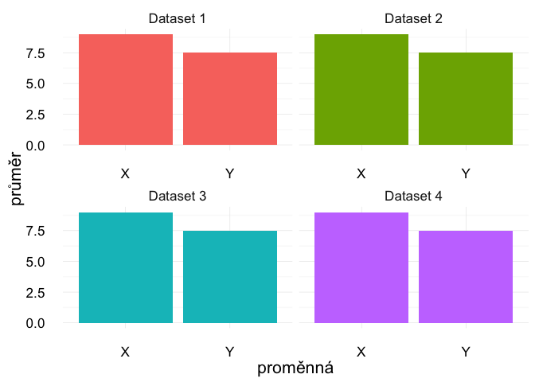
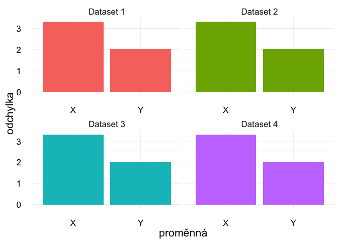
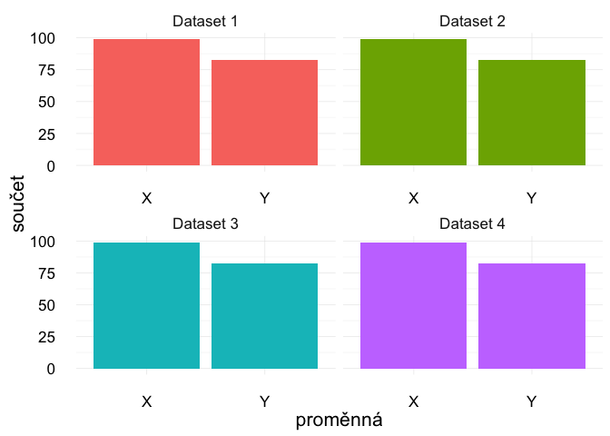
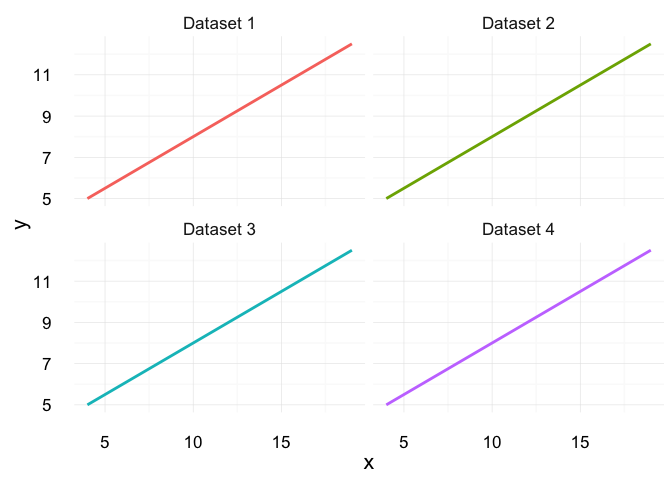
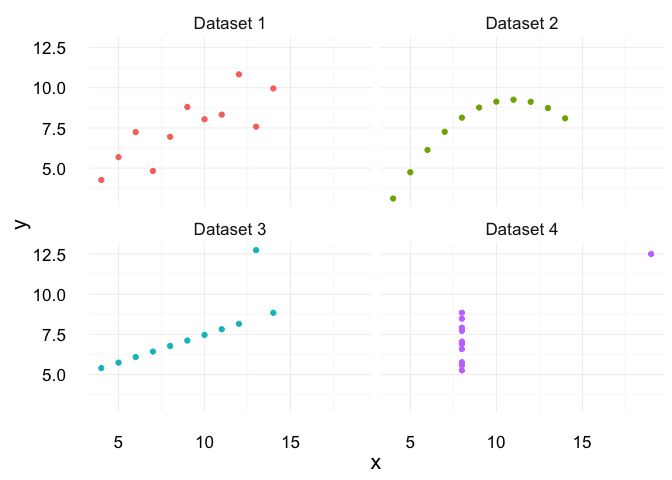

# Anscombův kvartet


```r
an2 <- anscombe %>% 
  gather(key = "key", value="value") %>% 
  separate(key,into = c("var","dataset"),1) %>%
  group_by(dataset, var) %>% 
  mutate(id = row_number()) %>% 
  spread(var, value) %>% 
  select(-id) %>% 
  ungroup() %>% 
  mutate(dataset = paste("Dataset", dataset))
```


```r
knitr::kable(anscombe)
```


 x1   x2   x3   x4      y1     y2      y3      y4
---  ---  ---  ---  ------  -----  ------  ------
 10   10   10    8    8.04   9.14    7.46    6.58
  8    8    8    8    6.95   8.14    6.77    5.76
 13   13   13    8    7.58   8.74   12.74    7.71
  9    9    9    8    8.81   8.77    7.11    8.84
 11   11   11    8    8.33   9.26    7.81    8.47
 14   14   14    8    9.96   8.10    8.84    7.04
  6    6    6    8    7.24   6.13    6.08    5.25
  4    4    4   19    4.26   3.10    5.39   12.50
 12   12   12    8   10.84   9.13    8.15    5.56
  7    7    7    8    4.82   7.26    6.42    7.91
  5    5    5    8    5.68   4.74    5.73    6.89


```r
an2sum <- an2 %>% group_by(dataset) %>%
  gather("proměnná","value", -dataset) %>% mutate(proměnná = toupper(proměnná)) %>% 
  group_by(dataset, proměnná) %>%
  summarise(průměr = mean(value), odchylka = sd(value), součet = sum(value)) 
```


```r
kable(an2sum %>% arrange(proměnná), digits = 2)
```


dataset     proměnná    průměr   odchylka   součet
----------  ---------  -------  ---------  -------
Dataset 1   X              9.0       3.32    99.00
Dataset 2   X              9.0       3.32    99.00
Dataset 3   X              9.0       3.32    99.00
Dataset 4   X              9.0       3.32    99.00
Dataset 1   Y              7.5       2.03    82.51
Dataset 2   Y              7.5       2.03    82.51
Dataset 3   Y              7.5       2.03    82.50
Dataset 4   Y              7.5       2.03    82.51


```r
mytheme <- theme_minimal() + theme(legend.position="none",
                                   text = element_text(size=16))
```

# Průměr proměnných X a Y, pro každý dataset


```r
an2sum %>% ggplot(aes(proměnná, průměr, fill=dataset)) + geom_bar(stat = "identity") +
  facet_wrap(~dataset, scales="free_x") + mytheme
```

<!-- -->


Průměr proměnných X a Y je stejný ve všech čtyřech datasetech.

# Směrodatná odchylka proměnných X a Y, pro každý dataset


```r
an2sum %>% ggplot(aes(proměnná, odchylka, fill=dataset)) + geom_bar(stat = "identity") +
  facet_wrap(~dataset, scales="free_x") + mytheme
```

<!-- -->

# Součet proměnných X a Y, pro každý dataset


```r
an2sum %>% ggplot(aes(proměnná, součet, fill=dataset)) + geom_bar(stat = "identity") +
  facet_wrap(~dataset, scales="free_x") + mytheme
```

<!-- -->

# Čára nejlépe popisující body v každém datasetu


```r
an2 %>% ggplot(aes(x, y, colour=dataset)) +
  geom_smooth(method='lm',formula=y~x, se = F, fullrange=TRUE) +
  facet_wrap(~dataset) + mytheme
```

<!-- -->

# A takto vypadají surová data...


```r
an2 %>% ggplot(aes(x, y, colour=dataset)) + geom_point() +
  facet_wrap(~dataset) + mytheme
```

<!-- -->

