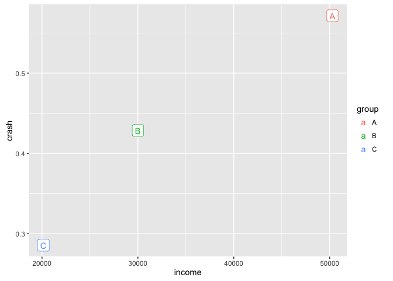
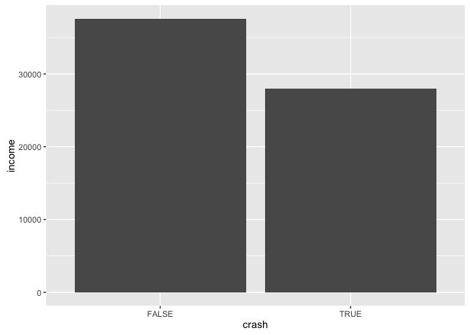
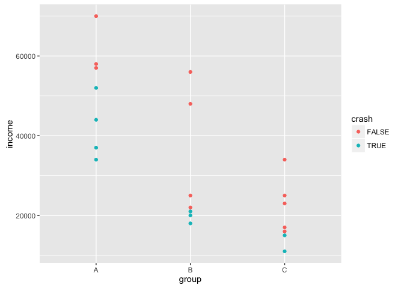
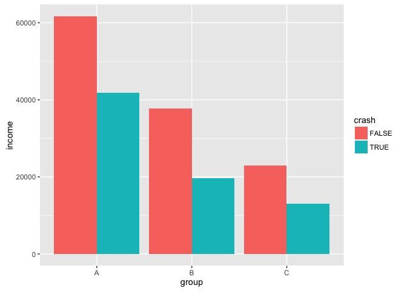
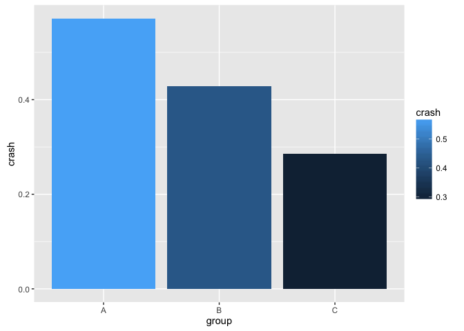

# Ecological


## Load data


```r
library(readxl)
library(dplyr)
```

```
## 
## Attaching package: 'dplyr'
```

```
## The following objects are masked from 'package:stats':
## 
##     filter, lag
```

```
## The following objects are masked from 'package:base':
## 
##     intersect, setdiff, setequal, union
```

```r
library(tibble)
```

```
## Warning: package 'tibble' was built under R version 3.2.5
```

```r
# ec <- read_excel("./ecological.xlsx", sheet = 1) %>% mutate(crash=as.logical(crash))
# head(ec)

ec <- frame_data(
  ~income, ~group, ~crash,
  34000,"A",TRUE,
  52000,"A",TRUE,
  57000,"A",FALSE,
  70000,"A",FALSE,
  58000,"A",FALSE,
  37000,"A",TRUE,
  44000,"A",TRUE,
  25000,"B",FALSE,
  22000,"B",FALSE,
  18000,"B",TRUE,
  48000,"B",FALSE,
  56000,"B",FALSE,
  21000,"B",TRUE,
  20000,"B",TRUE,
  16000,"C",FALSE,
  17000,"C",FALSE,
  23000,"C",FALSE,
  11000,"C",TRUE,
  15000,"C",TRUE,
  34000,"C",FALSE,
  25000,"C",FALSE
)
```

## Including Plots

You can also embed plots, for example:


```r
library(ggplot2)
bygrp %>% ggplot(aes(income,crash)) + geom_point() + geom_label(aes(label=group, colour=group))
```

<!-- -->

```r
bycrash %>% ggplot(aes(crash, income)) + geom_bar(stat="identity")
```

<!-- -->

```r
ec %>% ggplot(aes(group, income, group=group, colour=crash)) + geom_point()
```

<!-- -->

```r
byboth %>% ggplot(aes(group, income, fill=crash)) + geom_bar(stat="identity", position="dodge")
```

<!-- -->

```r
bygrp %>% ggplot(aes(group, crash, fill=crash)) + geom_bar(stat="identity", position="dodge")
```

<!-- -->

